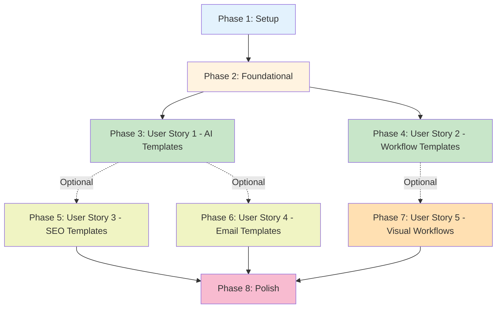

# Implementation Tasks: Default System Templates Migration

**Feature**: 019-default-templates
**Branch**: `019-default-templates`
**Spec**: [spec.md](./spec.md)
**Plan**: [plan.md](./plan.md)

## Overview

This document organizes implementation tasks by user story priority to enable independent, incremental delivery. Each user story represents a complete, testable increment of value.

**Key Principle**: User stories can be implemented and tested independently. Complete User Story 1 for MVP, then proceed to additional stories based on priority.

---

## Task Summary

- **Total Tasks**: 62
- **Parallelizable Tasks**: 52 (84%)
- **User Stories**: 5 (P1: 2 stories, P2: 2 stories, P3: 1 story)
- **MVP Scope**: User Story 1 only (AI Assistant Templates)

---

## Dependencies & Execution Order



**Notes**:
- **US1 and US2** are **P1** (both required for MVP)
- **US3 and US4** are **P2** (can be delivered independently after MVP)
- **US5** is **P3** (lowest priority, delivers after core value established)
- Solid lines = hard dependencies, Dotted lines = soft dependencies

---

## Implementation Strategy

### MVP (Minimum Viable Product)
**Scope**: User Story 1 + User Story 2
- 30+ AI assistant templates (ads, email, social media, landing pages, SEO, creative)
- 15+ workflow templates across all categories
- Idempotent migration
- **Delivers**: Complete core value - users can generate both individual content pieces and multi-step campaigns

### Post-MVP Increments
- **Increment 2 (P2)**: Additional SEO-specific templates (US3)
- **Increment 3 (P2)**: Additional email marketing templates (US4)
- **Increment 4 (P3)**: Visual workflow enhancements (US5)

---

## Phase 1: Setup & Prerequisites

**Goal**: Initialize migration structure and utilities

- [ ] T001 Create Alembic migration file in backend/migrations/versions/ named <timestamp>_seed_default_templates.py
- [ ] T002 [P] Implement deterministic UUID generation function in migration file using uuid.uuid5(namespace, name:category)
- [ ] T003 [P] Implement idempotency check function that queries templates by name + category + is_system=true
- [ ] T004 [P] Create template data structure classes/dicts in migration file for organizing template definitions
- [ ] T005 [P] Add logging utilities to migration for tracking insertions and skips

**Validation**:
- ✅ Migration file exists and follows Alembic conventions
- ✅ UUID generation is deterministic (same inputs = same UUID)
- ✅ Idempotency check can detect existing templates

---

## Phase 2: Foundational Tasks

**Goal**: Create shared infrastructure needed by all user stories

- [ ] T006 Define all 6 AI template categories constants: ads, landing_page, email, social_media, seo, creative
- [ ] T007 Define all 6 workflow template categories constants: social_media, paid_ads, blog, email, seo, creative
- [ ] T008 [P] Create helper function for consistent template metadata (created_at, is_system=true, is_active=true, usage_count=0)
- [ ] T009 [P] Create helper function for workflow metadata (is_system=true, is_recommended=true, version="1.0")
- [ ] T010 [P] Document variable naming standards in migration comments ({{variable_name}} format, snake_case)

**Validation**:
- ✅ Category constants match existing database enum values
- ✅ Helper functions generate correct metadata structure

---

## Phase 3: User Story 1 - AI Assistant Templates Discovery (P1)

**Story Goal**: Marketing agencies immediately find 30+ professional templates covering all marketing use cases

**Independent Test**: Create new account → Navigate to Templates → Verify 30+ templates visible → Filter by category → Select template → Verify description explains use case → Generate content and verify quality

### Paid Ads Templates (15 templates)

- [ ] T011 [P] [US1] Create "Anúncio Google Ads - Fórmula AIDA" template for search ads in backend/migrations/versions/<timestamp>_seed_default_templates.py
- [ ] T012 [P] [US1] Create "Google Responsive Search Ad (RSA)" template with 15 headlines + 5 descriptions in backend/migrations/versions/<timestamp>_seed_default_templates.py
- [ ] T013 [P] [US1] Create "Google Performance Max Campaign" template for omnichannel in backend/migrations/versions/<timestamp>_seed_default_templates.py
- [ ] T014 [P] [US1] Create "Google Display Ad - PAS Framework" template addressing pain points in backend/migrations/versions/<timestamp>_seed_default_templates.py
- [ ] T015 [P] [US1] Create "Google Shopping Ad - Product Optimization" template for e-commerce in backend/migrations/versions/<timestamp>_seed_default_templates.py
- [ ] T016 [P] [US1] Create "Facebook Feed Ad - Emotional Hook" template for e-commerce in backend/migrations/versions/<timestamp>_seed_default_templates.py
- [ ] T017 [P] [US1] Create "Instagram Story Ad - Value Proposition" template for flash sales in backend/migrations/versions/<timestamp>_seed_default_templates.py
- [ ] T018 [P] [US1] Create "Instagram Reels Ad - Native Format" template for product demos in backend/migrations/versions/<timestamp>_seed_default_templates.py
- [ ] T019 [P] [US1] Create "Facebook Carousel Ad - Feature Showcase" template for multi-product in backend/migrations/versions/<timestamp>_seed_default_templates.py
- [ ] T020 [P] [US1] Create "Meta Lead Generation Ad" template for B2B lead magnets in backend/migrations/versions/<timestamp>_seed_default_templates.py
- [ ] T021 [P] [US1] Create "Meta Retargeting Ad - Objection Handling" template for cart abandoners in backend/migrations/versions/<timestamp>_seed_default_templates.py
- [ ] T022 [P] [US1] Create "LinkedIn Sponsored Content - Thought Leadership" template for B2B SaaS in backend/migrations/versions/<timestamp>_seed_default_templates.py
- [ ] T023 [P] [US1] Create "LinkedIn InMail - Personalized Outreach" template for decision-makers in backend/migrations/versions/<timestamp>_seed_default_templates.py
- [ ] T024 [P] [US1] Create "LinkedIn Video Ad - Case Study" template for social proof in backend/migrations/versions/<timestamp>_seed_default_templates.py
- [ ] T025 [P] [US1] Create "LinkedIn Carousel Ad - Educational Value" template for whitepapers in backend/migrations/versions/<timestamp>_seed_default_templates.py

### Social Media Templates (7 templates)

- [ ] T026 [P] [US1] Create "Post Instagram - Transformação (BAB)" template for transformation products in backend/migrations/versions/<timestamp>_seed_default_templates.py
- [ ] T027 [P] [US1] Create "Instagram Reels Script - Hook + Value" template for viral content in backend/migrations/versions/<timestamp>_seed_default_templates.py
- [ ] T028 [P] [US1] Create "Facebook Community Post - Conversational" template for engagement in backend/migrations/versions/<timestamp>_seed_default_templates.py
- [ ] T029 [P] [US1] Create "LinkedIn Thought Leadership Post" template for industry insights in backend/migrations/versions/<timestamp>_seed_default_templates.py
- [ ] T030 [P] [US1] Create "Twitter Thread - Storytelling" template for expertise sharing in backend/migrations/versions/<timestamp>_seed_default_templates.py
- [ ] T031 [P] [US1] Create "Instagram Stories Sequence (5 Stories)" template for product launch in backend/migrations/versions/<timestamp>_seed_default_templates.py
- [ ] T032 [P] [US1] Create "UGC Request Post" template for building social proof in backend/migrations/versions/<timestamp>_seed_default_templates.py

### Landing Page Templates (7 templates)

- [ ] T033 [P] [US1] Create "Hero Section - AIDA Framework" template for homepage in backend/migrations/versions/<timestamp>_seed_default_templates.py
- [ ] T034 [P] [US1] Create "Value Proposition Section - FAB Method" template for product pages in backend/migrations/versions/<timestamp>_seed_default_templates.py
- [ ] T035 [P] [US1] Create "Social Proof Section" template with testimonials and stats in backend/migrations/versions/<timestamp>_seed_default_templates.py
- [ ] T036 [P] [US1] Create "Pricing Section - Objection Handling" template for SaaS in backend/migrations/versions/<timestamp>_seed_default_templates.py
- [ ] T037 [P] [US1] Create "Lead Magnet Landing Page" template for ebook downloads in backend/migrations/versions/<timestamp>_seed_default_templates.py
- [ ] T038 [P] [US1] Create "Webinar Registration Page" template for virtual events in backend/migrations/versions/<timestamp>_seed_default_templates.py
- [ ] T039 [P] [US1] Create "Long-Form Sales Page - 4Ps Framework" template for high-ticket in backend/migrations/versions/<timestamp>_seed_default_templates.py

### Creative/General Templates (7 templates)

- [ ] T040 [P] [US1] Create "História da Marca - StoryBrand" template for About pages in backend/migrations/versions/<timestamp>_seed_default_templates.py
- [ ] T041 [P] [US1] Create "Product Description - E-commerce FAB" template for online stores in backend/migrations/versions/<timestamp>_seed_default_templates.py
- [ ] T042 [P] [US1] Create "Product Description - Storytelling" template for premium products in backend/migrations/versions/<timestamp>_seed_default_templates.py
- [ ] T043 [P] [US1] Create "Brand Manifesto - Inspirational" template for mission-driven brands in backend/migrations/versions/<timestamp>_seed_default_templates.py
- [ ] T044 [P] [US1] Create "Company About Page" template with authenticity and authority in backend/migrations/versions/<timestamp>_seed_default_templates.py
- [ ] T045 [P] [US1] Create "Video Script - Brand Documentary" template for YouTube in backend/migrations/versions/<timestamp>_seed_default_templates.py
- [ ] T046 [P] [US1] Create "Tagline & Slogan Generator" template for brand positioning in backend/migrations/versions/<timestamp>_seed_default_templates.py

### Migration Implementation for US1

- [ ] T047 [US1] Aggregate all AI templates (T011-T046) into templates_data list in migration upgrade() function
- [ ] T048 [US1] Implement template insertion loop with idempotency check and UUID generation in migration upgrade() function
- [ ] T049 [US1] Add template insertion logging (count inserted, count skipped) in migration upgrade() function
- [ ] T050 [US1] Test migration on local database and verify 36+ templates inserted in backend/migrations/versions/<timestamp>_seed_default_templates.py

**US1 Validation Criteria**:
- ✅ 36 AI assistant templates created (exceeds 30 minimum)
- ✅ All 6 categories have at least 5 templates each
- ✅ All templates use proven frameworks (AIDA, PAS, BAB, FAB, 4Ps, StoryBrand)
- ✅ All templates in Brazilian Portuguese
- ✅ Variable placeholders follow {{snake_case}} format
- ✅ Migration is idempotent (re-run doesn't create duplicates)

---

## Phase 4: User Story 2 - Workflow Template Automation (P1)

**Story Goal**: Traffic managers find 15+ pre-built workflow automations that generate complete campaigns

**Independent Test**: Navigate to Workflows → Click "Browse Templates" → Verify 15+ workflows visible → Select workflow → Click "Use Template" → Verify copied to project → Execute workflow → Verify all outputs generated

### Email Marketing Workflows (3 workflows)

- [ ] T051 [P] [US2] Create "Sequência de E-mail - Boas-vindas (3 E-mails)" workflow with welcome sequence nodes in backend/migrations/versions/<timestamp>_seed_default_templates.py
- [ ] T052 [P] [US2] Create "Sequência de Nutrição por E-mail (6 E-mails)" workflow with full nurture journey in backend/migrations/versions/<timestamp>_seed_default_templates.py
- [ ] T053 [P] [US2] Create "Campanha de Carrinho Abandonado" workflow with recovery email sequence in backend/migrations/versions/<timestamp>_seed_default_templates.py

### Paid Ads Workflows (3 workflows)

- [ ] T054 [P] [US2] Create "Campanha Completa de Anúncios Meta" workflow generating headlines + descriptions + images + landing page in backend/migrations/versions/<timestamp>_seed_default_templates.py
- [ ] T055 [P] [US2] Create "Campanha Google Ads Multi-Formato" workflow for search + display + video ads in backend/migrations/versions/<timestamp>_seed_default_templates.py
- [ ] T056 [P] [US2] Create "Teste A/B de Anúncios" workflow generating 3 ad variations for comparison in backend/migrations/versions/<timestamp>_seed_default_templates.py

### Social Media Workflows (3 workflows)

- [ ] T057 [P] [US2] Create "Calendário de Conteúdo Social Media (7 Dias)" workflow with loop generating 7 posts in backend/migrations/versions/<timestamp>_seed_default_templates.py
- [ ] T058 [P] [US2] Create "Lançamento de Produto nas Redes Sociais" workflow with pre-launch teasers + countdown + launch posts in backend/migrations/versions/<timestamp>_seed_default_templates.py
- [ ] T059 [P] [US2] Create "Campanha Social Completa" workflow generating post + image + stories + captions in backend/migrations/versions/<timestamp>_seed_default_templates.py

### SEO/Blog Workflows (3 workflows)

- [ ] T060 [P] [US2] Create "Hub de Conteúdo SEO" workflow generating pillar post + supporting posts + meta tags in backend/migrations/versions/<timestamp>_seed_default_templates.py
- [ ] T061 [P] [US2] Create "Cluster de Tópico SEO" workflow with topic cluster + internal linking suggestions in backend/migrations/versions/<timestamp>_seed_default_templates.py
- [ ] T062 [P] [US2] Create "Série de Blog Posts" workflow generating 5 related blog posts with consistent theme in backend/migrations/versions/<timestamp>_seed_default_templates.py

### Creative/Mixed Workflows (3 workflows)

- [ ] T063 [P] [US2] Create "Lançamento de Produto Completo" workflow with announcement email + social + landing page + ads in backend/migrations/versions/<timestamp>_seed_default_templates.py
- [ ] T064 [P] [US2] Create "Campanha de Marca" workflow generating brand story + visual assets + social content in backend/migrations/versions/<timestamp>_seed_default_templates.py
- [ ] T065 [P] [US2] Create "Gerador de Conteúdo Multi-Canal" workflow distributing single topic across blog + email + social in backend/migrations/versions/<timestamp>_seed_default_templates.py

### Migration Implementation for US2

- [ ] T066 [US2] Aggregate all workflow templates (T051-T065) into workflow_templates_data list in migration upgrade() function
- [ ] T067 [US2] Implement workflow insertion loop with idempotency check and UUID generation in migration upgrade() function
- [ ] T068 [US2] Add workflow insertion logging (count inserted, count skipped) in migration upgrade() function
- [ ] T069 [US2] Test workflow templates on local database and verify 15 workflows inserted in backend/migrations/versions/<timestamp>_seed_default_templates.py

**US2 Validation Criteria**:
- ✅ 15 workflow templates created
- ✅ All workflows include properly configured nodes_json and edges_json
- ✅ All workflows use variable references ({{input.variable}}, {{node_id.field}})
- ✅ Workflows span all 6 categories (email, paid_ads, social_media, seo, blog, creative)
- ✅ Each workflow is independently executable
- ✅ Migration is idempotent for workflows

---

## Phase 5: User Story 3 - SEO Content Templates (P2)

**Story Goal**: SEO specialists find templates for keyword-optimized content creation

**Independent Test**: Filter templates by "SEO & Blog" → Verify 7+ SEO templates → Select blog post template → Provide keyword → Generate content → Verify SEO optimization (keyword density, H1/H2/H3 structure)

- [ ] T070 [P] [US3] Create "Artigo de Blog SEO - Guia Completo (2000+ palavras)" template with pillar content structure in backend/migrations/versions/<timestamp>_seed_default_templates.py
- [ ] T071 [P] [US3] Create "Gerador de Title Tag SEO" template with 10 variations optimized for CTR in backend/migrations/versions/<timestamp>_seed_default_templates.py
- [ ] T072 [P] [US3] Create "Gerador de Meta Description" template with 155-160 character optimization in backend/migrations/versions/<timestamp>_seed_default_templates.py
- [ ] T073 [P] [US3] Create "Post How-To - Passo a Passo" template for long-tail keywords in backend/migrations/versions/<timestamp>_seed_default_templates.py
- [ ] T074 [P] [US3] Create "Listicle Blog Post - Engajamento + SEO" template for featured snippets in backend/migrations/versions/<timestamp>_seed_default_templates.py
- [ ] T075 [P] [US3] Create "Post de Comparação - Bottom-of-Funnel" template for buyer intent in backend/migrations/versions/<timestamp>_seed_default_templates.py
- [ ] T076 [P] [US3] Create "Conteúdo SEO Local - Páginas de Localização" template for multi-location businesses in backend/migrations/versions/<timestamp>_seed_default_templates.py
- [ ] T077 [US3] Add US3 templates (T070-T076) to templates_data list and re-run migration test

**US3 Validation Criteria**:
- ✅ 7 SEO-specific templates added
- ✅ Templates optimized for search intent (informational, commercial, transactional)
- ✅ Templates include keyword density guidance
- ✅ Templates use proper heading structure (H1/H2/H3)

---

## Phase 6: User Story 4 - Email Marketing Templates (P2)

**Story Goal**: Email marketers find conversion-optimized templates for every funnel stage

**Independent Test**: Filter by "Email Marketing" → Verify templates for welcome, nurture, conversion, retention → Select welcome email → Generate → Verify AIDA structure with clear CTA

- [ ] T078 [P] [US4] Create "E-mail de Boas-vindas - Primeira Impressão" template for day 0 onboarding in backend/migrations/versions/<timestamp>_seed_default_templates.py
- [ ] T079 [P] [US4] Create "E-mail de Nutrição - Entregar Valor" template for lead warming in backend/migrations/versions/<timestamp>_seed_default_templates.py
- [ ] T080 [P] [US4] Create "E-mail Promocional - Oferta Limitada" template with urgency and scarcity in backend/migrations/versions/<timestamp>_seed_default_templates.py
- [ ] T081 [P] [US4] Create "E-mail de Carrinho Abandonado" template with recovery incentive in backend/migrations/versions/<timestamp>_seed_default_templates.py
- [ ] T082 [P] [US4] Create "E-mail de Reengajamento - Win-Back" template for inactive subscribers in backend/migrations/versions/<timestamp>_seed_default_templates.py
- [ ] T083 [P] [US4] Create "Newsletter - Digest de Conteúdo" template for regular communication in backend/migrations/versions/<timestamp>_seed_default_templates.py
- [ ] T084 [P] [US4] Create "E-mail de Lançamento de Produto" template with early bird offer in backend/migrations/versions/<timestamp>_seed_default_templates.py
- [ ] T085 [P] [US4] Create "E-mail Pós-Compra - Fidelização" template with usage tips and cross-sell in backend/migrations/versions/<timestamp>_seed_default_templates.py
- [ ] T086 [US4] Add US4 templates (T078-T085) to templates_data list and re-run migration test

**US4 Validation Criteria**:
- ✅ 8 email marketing templates added
- ✅ Templates cover all funnel stages (awareness, consideration, conversion, retention)
- ✅ Each template uses appropriate framework (AIDA, PAS, storytelling)
- ✅ Subject lines included with each template

---

## Phase 7: User Story 5 - Visual Workflow Templates (P3)

**Story Goal**: Creative directors use workflows combining text + image generation for brand consistency

**Independent Test**: Select "Complete Social Campaign" workflow → Execute → Verify both text and image outputs → Check visual coherence with copy tone

- [ ] T087 [P] [US5] Create "Campanha Visual Instagram" workflow generating post copy + carousel images + stories in backend/migrations/versions/<timestamp>_seed_default_templates.py
- [ ] T088 [P] [US5] Create "Kit de Marca Visual" workflow generating brand story + logo concepts + color palette in backend/migrations/versions/<timestamp>_seed_default_templates.py
- [ ] T089 [P] [US5] Create "Anúncio Criativo Completo" workflow with headline + visual + landing page hero image in backend/migrations/versions/<timestamp>_seed_default_templates.py
- [ ] T090 [US5] Add US5 workflows (T087-T089) to workflow_templates_data list and re-run migration test

**US5 Validation Criteria**:
- ✅ 3 visual-focused workflows added
- ✅ Workflows include both text_generation and image_generation nodes
- ✅ Image prompts reference generated text for consistency
- ✅ Brand guidelines variable used throughout

---

## Phase 8: Polish & Quality Assurance

**Goal**: Finalize migration, add documentation, and validate end-to-end

- [ ] T091 [P] Implement downgrade() function in migration that deletes all system templates (WHERE is_system=true)
- [ ] T092 [P] Add comprehensive docstring to migration file explaining idempotency and rollback
- [ ] T093 [P] Add inline comments explaining UUID generation and duplicate detection logic
- [ ] T094 Test complete migration on fresh local database and verify counts: 51 templates + 18 workflows
- [ ] T095 Test migration idempotency by running upgrade twice and verifying no duplicates created
- [ ] T096 Test migration downgrade and verify all system templates removed
- [ ] T097 [P] Test API endpoint GET /templates?is_system=true returns all 51 templates
- [ ] T098 [P] Test API endpoint GET /workflows?is_system=true returns all 18 workflows
- [ ] T099 [P] Test API endpoint GET /templates?is_system=true&category=ads returns 15 paid ads templates
- [ ] T100 [P] Test API endpoint GET /workflows?is_system=true&category=email returns 3 email workflows
- [ ] T101 [P] Manually test 5 random AI templates by generating content and verifying quality and framework adherence
- [ ] T102 [P] Manually test 3 random workflows by executing and verifying all nodes complete successfully
- [ ] T103 Test frontend at /workspace/{id}/templates and verify all 51 templates display correctly with categories
- [ ] T104 Test frontend at /workspace/{id}/workflows and verify all 18 workflows display correctly
- [ ] T105 [P] Document migration in quickstart.md with deployment checklist and rollback instructions
- [ ] T106 [P] Update CLAUDE.md with feature summary: "Added 51 AI templates + 18 workflow templates via migration 019"

**Validation**:
- ✅ Migration completes in under 60 seconds
- ✅ All success criteria from spec.md are met
- ✅ Migration is idempotent (verified by re-running)
- ✅ Rollback procedure tested and works correctly
- ✅ API endpoints return correct template counts and data
- ✅ Frontend UI displays all templates correctly
- ✅ Sample templates generate high-quality, framework-adhering content

---

## Parallel Execution Opportunities

### During Phase 3 (US1 - AI Templates)
All template creation tasks (T011-T046) can be executed in parallel as they modify different data structures with no dependencies.

**Example parallel execution**:
```bash
# Engineer 1: Paid Ads templates (T011-T025)
# Engineer 2: Social Media templates (T026-T032)
# Engineer 3: Landing Page templates (T033-T039)
# Engineer 4: Creative templates (T040-T046)
```

### During Phase 4 (US2 - Workflow Templates)
All workflow creation tasks (T051-T065) can be executed in parallel.

**Example parallel execution**:
```bash
# Engineer 1: Email workflows (T051-T053)
# Engineer 2: Paid Ads workflows (T054-T056)
# Engineer 3: Social Media workflows (T057-T059)
# Engineer 4: SEO workflows (T060-T062)
# Engineer 5: Creative workflows (T063-T065)
```

### During Phase 8 (Polish)
Most validation and testing tasks (T097-T104) can run in parallel as they are read-only verification steps.

---

## Success Criteria Tracking

| ID | Criterion | Validation Task | Status |
|----|-----------|----------------|--------|
| SC-001 | Users find template in 2 minutes | T103 (frontend test) | ⏳ Pending |
| SC-002 | 30+ templates, 5+ per category | T094 (count verification) | ⏳ Pending |
| SC-003 | 80% template usage rate | Post-deployment analytics | ⏳ Pending |
| SC-004 | 90% first-attempt success | T101 (manual testing) | ⏳ Pending |
| SC-005 | 95% workflow execution success | T102 (workflow testing) | ⏳ Pending |
| SC-006 | Campaign time: 2hr → 15min | User feedback post-launch | ⏳ Pending |
| SC-007 | 5+ frameworks demonstrated | T101 (manual verification) | ⏳ Pending |
| SC-008 | Zero duplicates on re-run | T095 (idempotency test) | ⏳ Pending |

---

## Notes

### Content Quality Guidelines

All template content must follow these standards:
- **Language**: Brazilian Portuguese (PT-BR) exclusively
- **Frameworks**: Explicitly reference framework used (AIDA, PAS, BAB, FAB, 4Ps, StoryBrand)
- **Variables**: Use `{{snake_case}}` format consistently
- **Descriptions**: Explain marketing context, ideal use case, expected output
- **Tone**: Professional but accessible, not overly technical
- **Length**: Prompts should be 200-500 words for clarity without verbosity

### Testing Priority

Focus manual testing on:
1. **High-usage templates**: Google Ads, Meta Ads, Email sequences (most common use cases)
2. **Complex workflows**: Multi-step workflows with loops or conditionals
3. **Framework adherence**: Verify AIDA structure in outputs, PAS problem-solution flow, etc.

### Deployment Strategy

**Recommended approach**:
1. Deploy US1 + US2 to production (MVP: 51 templates + 18 workflows)
2. Monitor usage analytics for 1 week
3. Deploy US3 + US4 based on category demand (if SEO/Email show high interest)
4. Deploy US5 last (visual workflows are enhancement, not core value)

### Rollback Plan

If templates cause issues:
1. Run `alembic downgrade -1` to remove all seeded templates
2. Verify via SQL: `SELECT COUNT(*) FROM templates WHERE is_system=true` (should be 0)
3. Fix migration issues
4. Re-run `alembic upgrade head`

### Post-Launch Monitoring

Track for 2 weeks after deployment:
- Template usage rate per category
- Template error rate (failed generations)
- Workflow execution success rate
- User feedback on template quality
- Most/least used templates (inform v2 improvements)

---

**Task List Version**: 1.0
**Last Updated**: 2025-12-04
**Next Phase**: Execute Phase 1 (Setup) tasks to begin implementation
